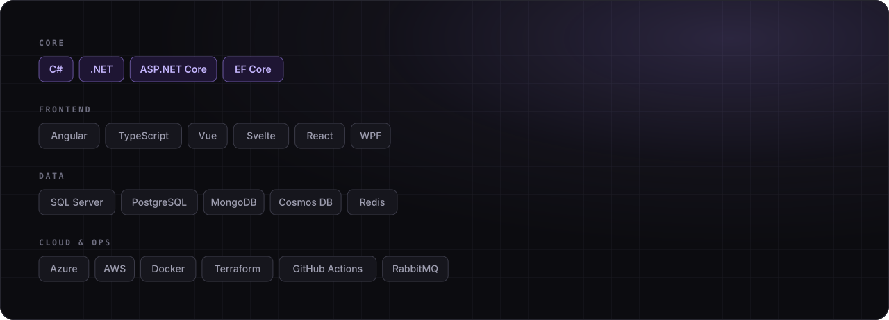
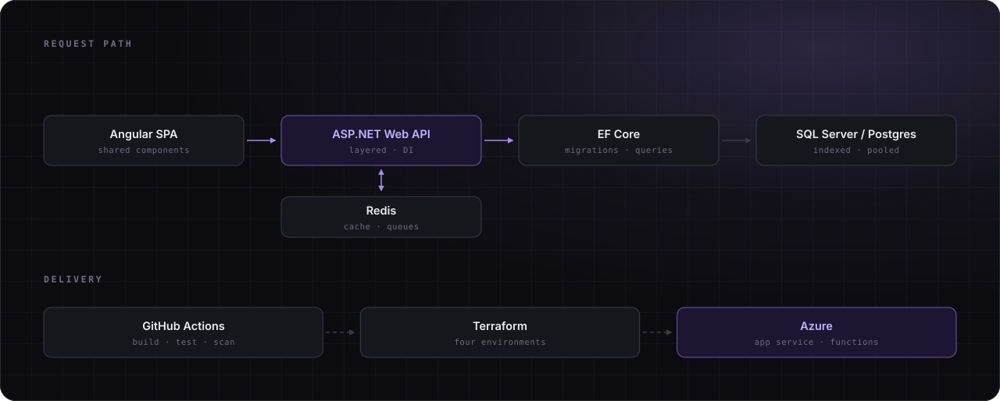

Full-stack engineer, eight years on **.NET** — backend systems, Angular front-ends, and cloud-native delivery on Azure and AWS.

## How I build it

## What I work on

<b>Backend</b> — ASP.NET Core, EF Core, API design

- **ASP.NET Core** (Web API & MVC) on modern .NET — minimal APIs, middleware, background services
- **EF Core** against SQL Server and PostgreSQL — migrations, compiled queries, split queries, killing N+1
- **API design** — versioning, FluentValidation, ProblemDetails, OpenAPI contracts clients can trust

<b>Frontend</b> — Angular, Vue, Svelte, React

- **Angular** as the default, plus Vue, Svelte and React — wired to .NET APIs with typed clients from OpenAPI
- **WPF / WinForms** where the product is a desktop application
- HTML5, CSS3, **TypeScript**, responsive layouts and accessible markup

<b>Cloud &amp; DevOps</b> — Azure, Docker, CI/CD

- **Azure** — App Service, Functions, Container Apps, Key Vault, Application Insights
- **Docker** multi-stage builds — slim runtime images, health checks, sane layer caching
- **CI/CD** with GitHub Actions and Azure DevOps — build, test, scan, deploy on every push

<b>Performance</b> — the part most people skip

- Query and **index tuning** driven by execution plans, not guesswork
- Fixing **N+1** and over-eager `Include` chains before they reach production
- **Caching** layers that actually invalidate — output caching, `IDistributedCache`, Redis
- Benchmarking with **BenchmarkDotNet**, so "faster" is a number rather than a feeling

<b>Security</b> — secure by default

- **ASP.NET Core Identity**, JWT and cookie auth, policy-based authorisation
- Defence against **XSS, CSRF, SQL injection** and IDOR — parameterise everything, authorise every handler
- Secrets in **Key Vault**, never in `appsettings.json`

<b>Testing</b> — so refactors aren't scary

- **xUnit / NUnit** with **Moq** or NSubstitute for unit tests
- Integration tests via **`WebApplicationFactory`** and **Testcontainers** against a real database
- Tests wired into CI — a red build blocks the merge

<!--
## Selected work

Điền 2–4 repo tiêu biểu vào bảng rồi bỏ comment block này. Dùng bảng thay
cho card pin của github-readme-stats: dịch vụ đó hay bị rate-limit và card
sẽ hỏng, còn bảng thì không bao giờ.

| Project | What it does | Stack |
| --- | --- | --- |
| [repo-name](https://github.com/phuongfullstack/repo-name) | Một câu về vấn đề nó giải quyết. | ASP.NET Core, EF Core, Azure |
-->

## GitHub

Every card above is generated by <a href="https://github.com/phuongfullstack/phuongfullstack/actions/workflows/profile-assets.yml">a workflow in this repository</a> — no third-party stats service.

## Contact

Happy to talk about .NET architecture, a query that got slow, or a project you're planning.

